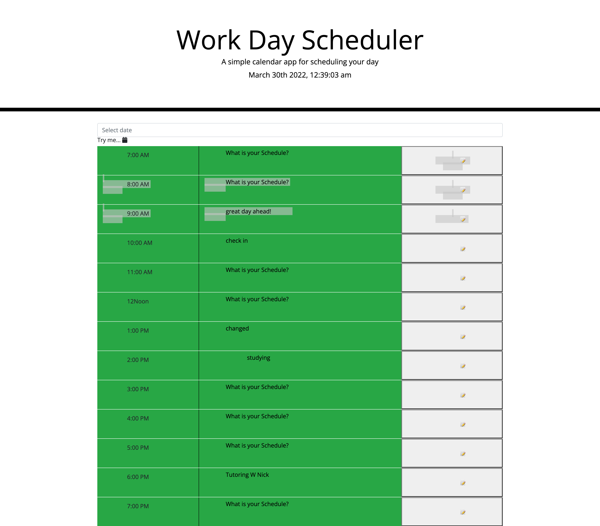

# Jenn-Calendar-Scheduler

The goal of this project was to have a daily planner to write out your schedule hour by hour

## Run

to use the site simply pull up the website. find the hour that you would like to log an event, use the imput area to log the title of your scheduled event and click the '📝 '  to log it. 

## to use 

to use this project you will need to have your internet working and your display on. You will need to know the time and the name of the event you would like to keep track of. When you are ready to log an event, then you will follow the run above. you will be able to see if a time has passed by the color changes to red, if it is the current time it is gray, but if the the time is avalable it is green. 
a great way to stay orgainzed!

### links

![Live Link] (https://jpcrreativeworks.github.io/Jenn-Calendar-Scheduler)

